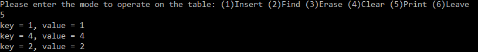

# Hashtable

This is a personal project for **Algorithms and Data Structures**

* The goal is to create a **generic** class of **HashTable** that supports `size`, `empty`, `find(key)`, `erase(key)`, `insert(key, element)`, indexing operator, and `clear` as a simplified implementation of map

> All of these operations behave like the [STL map](https://cplusplus.com/reference/map/map/) operations except that `insert` returns a Boolean value that indicates whether the insertion occurred and `find` returns a pointer to the element if the search is successful, or *nullptr* if the search is unsuccessful. 

> As for generic, **keys** are always `int`, but **elements** can be of any type


* [hashtable.exe](hashtable.exe) is an executable file that takes input from users and performs the operations accordingly on the map
> For demonstration purpose only, **elements** are restricted to be `int`

* [Source.cpp](Source.cpp) contains all my code for this project. It contains two main functions:
1. The main function that implements [hashtable.exe](hashtable.exe) to demonstrate the functionalities of **HashTable**
2. The main function that allows **elements** to be of any type, and can be used to demonstrate the functionality of `indexing operator`

## Details

* **HashTable** itself is stored in a [vector](https://cplusplus.com/reference/vector/vector/), each of which contains a vector of pairs to store key-value pairs for users.


* The default **HashTable** is a vector of size **3**.

* A key-value pair is hashed into the table using modulo % on the key value and the current table size 

* When two key-value pairs are hashed into the same index of the table, they are always inserted in ascending order based on their key values 


* Whenever the load factor is about to exceed **0.8**, **HashTable** will **rehash** the stored key-value pairs after increasing the size of the table to twice the current size plus one

Here is a demonstration of rehashing:


https://user-images.githubusercontent.com/84282744/188362459-c50815ef-a58d-4d75-b638-ca786a25fee9.mp4


From the above video, since the default **HashTable** is of size 3, the pair which `key = 1` and the pair which `key = 4` are both hased to ```HashTable[1]``` . Therefore, when printing the table, it shows

<p> </p>


NOTE: The pair which `key = 2` is showed after the pair which `key = 4`.

However, after inserting one more pair into the table, **HashTable** is increased to size **7**, so the pair which `key = 4` is rehashed to ```HashTable[4]```. Therefore, when printing the table, we see:

<p> </p>


### Demo
1. Demonstartion of **HashTable** taking input from **stdin**


https://user-images.githubusercontent.com/84282744/188362538-9c63f887-8e12-4bff-ace5-43fd3607cb32.mp4


2. Demonstartion of **operator[]** in **HashTable** 

<p> </p>

